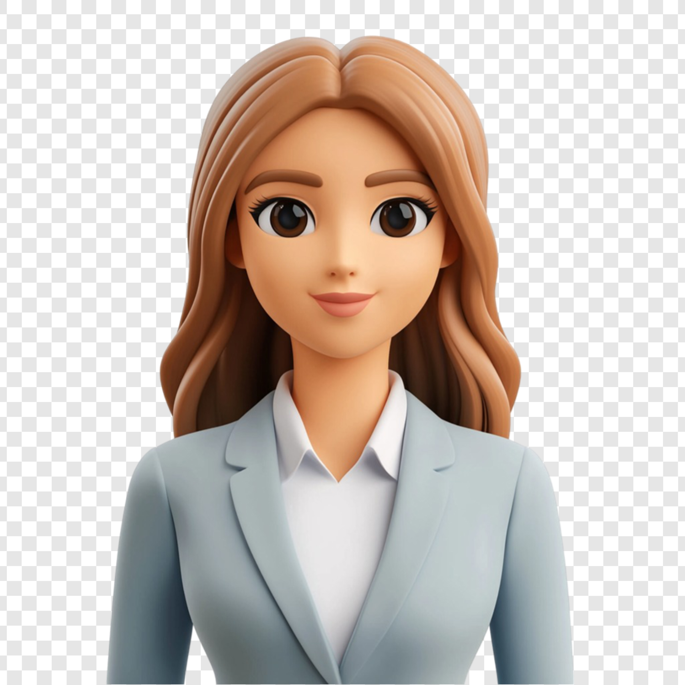

<html lang="en">
<head>
    <meta charset="UTF-8">
    <meta name="viewport" content="width=device-width, initial-scale=1.0">
    <title>Portfolio</title>
    <link rel="stylesheet" href="styles.css">
    
</head>
<body>
    <header>
        
&#x2728;Portfolio

        <nav>
            <ul class="nav-menu">
                <li><a href="#">About</a></li>
                <li><a href="#">Experience</a></li>
                <li><a href="#">Skills</a></li>
                <li><a href="#">Project</a></li>
            </ul>
        </nav>
    </header>
    <section class="hero">
        
        

            <h1>Hello! I am Poonam kalra</h1>
            
A Designer who Judges a book by its cover

            
Currently, I'm a Software Engineer at Facebook

        

    </section>
    <section class="experience">
        <h2>Work Experience</h2>
        

            

                <h3>Software Engineer at Facebook</h3>
                
Developing scalable web applications and leading frontend development for multiple projects.

                
<strong>Duration:</strong> 2022 - Present

            

            

                <h3>Frontend Developer at Google</h3>
                
Worked on UI/UX for Google's internal tools, enhancing performance and usability.

                
<strong>Duration:</strong> 2019 - 2022

            

            

                <h3>Intern at Microsoft</h3>
                
Contributed to open-source projects and assisted in developing a real-time dashboard.

                
<strong>Duration:</strong> 2018 - 2019

            

        

    </section>
    <section class="projects">
        <h2>Featured Project</h2>
        

            
            

                <h3>Spotify Data Visualizer</h3>
                
A web app for visualizing personalized Spotify data using React and D3.js.

                
<strong>Technologies:</strong> React, D3.js, Spotify API

            

        

    </section>
    <footer>
        
Contact: poonamkalra67@gmail.com

    </footer>
</body>
</html>